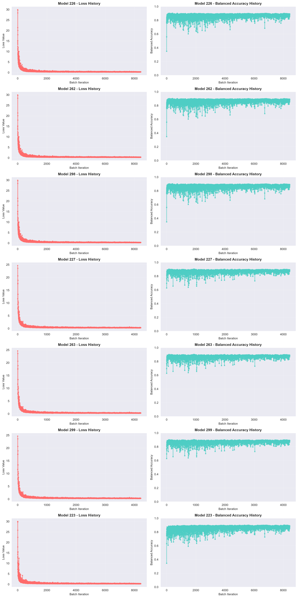
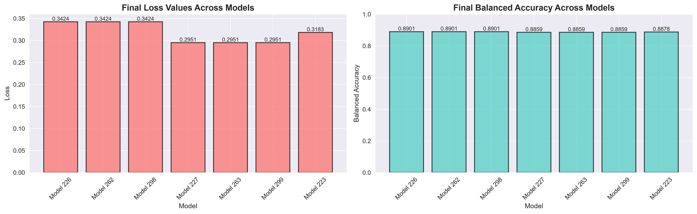
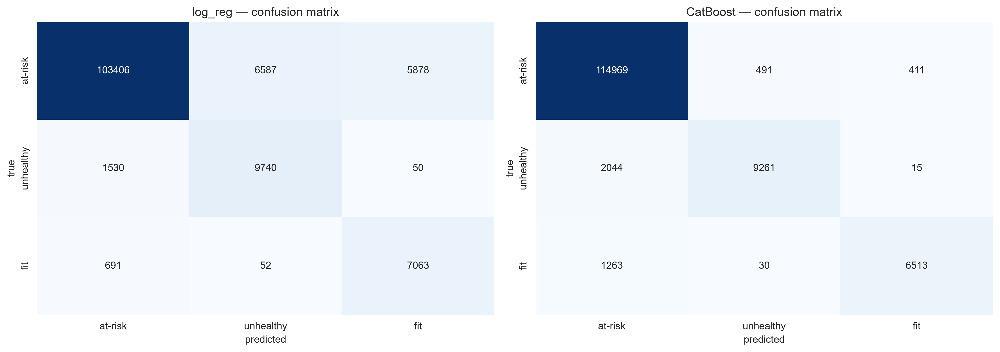
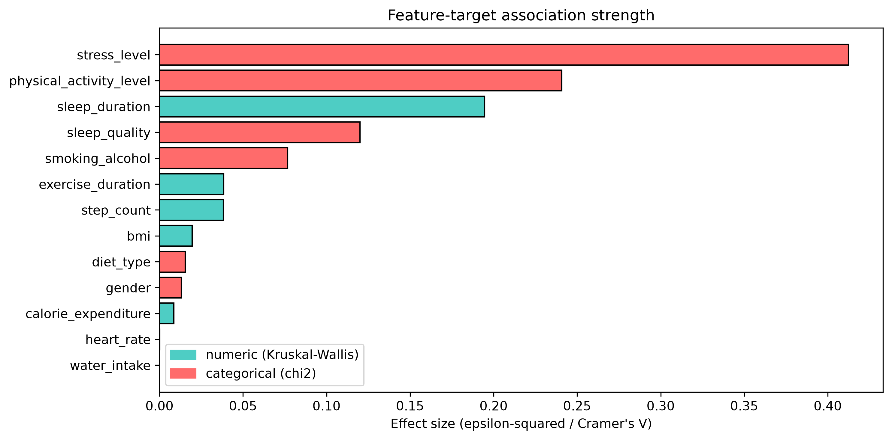
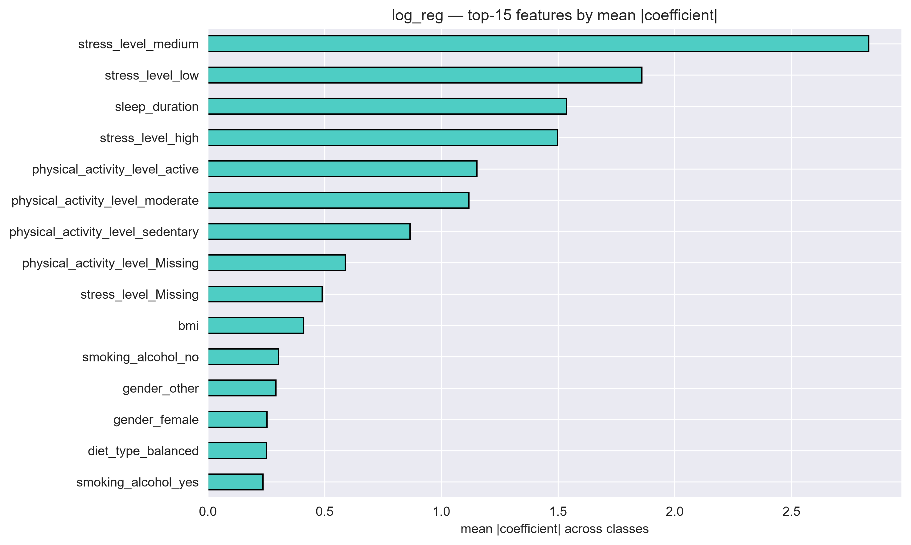
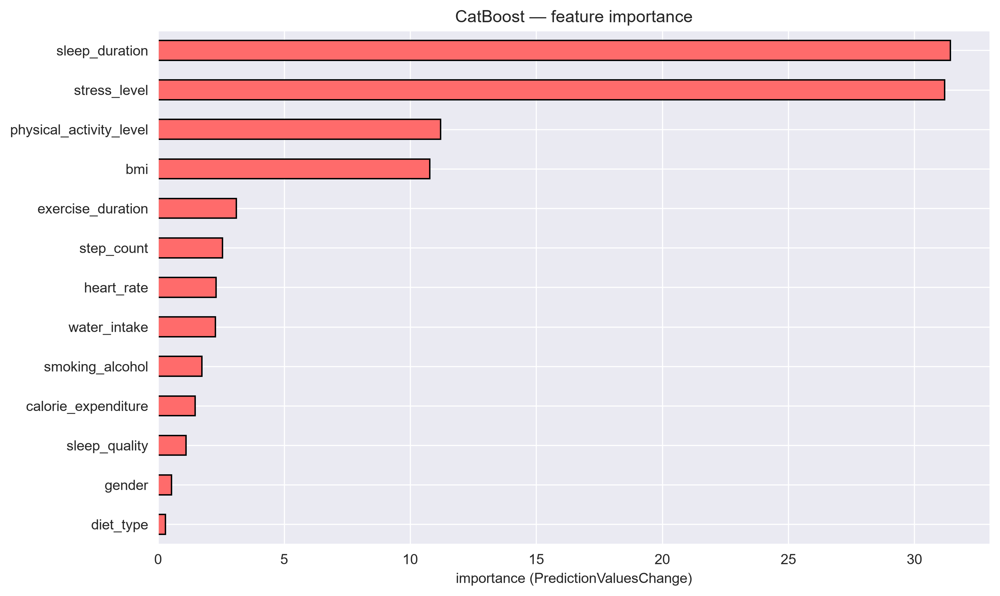

# Predicting Student Health Risk

Multiclass classification of student health condition (`at-risk` / `unhealthy` / `fit`)
from lifestyle and health-metric data. Pet project built on the Kaggle Playground
Series S6E7 competition (July 2026, ~3,200 participants).

**Final results (balanced accuracy):**

| Model | Local holdout | 5-fold CV | Kaggle Leaderboard |
|---|---|---|---|
| **Linear (SGDClassifier, hinge loss)** | 0.886 | 0.890 | **0.88298** |
| **CatBoost (baseline)** | 0.882 | — | **0.87466** |

The linear model slightly outperforms gradient boosting and is fully
interpretable — see [Key findings](#key-findings).

---

## 1. Task

- **Competition:** [Predicting Student Health Risk — Playground Series S6E7](https://www.kaggle.com/competitions/playground-series-s6e7)
- **Goal:** predict the `health_condition` of a student (3 classes) from 13 features.
- **Metric:** balanced accuracy — the right choice here because the target is
  heavily imbalanced: `at-risk` 85.9%, `unhealthy` 8.4%, `fit` 5.8%.

## 2. Data

- `train.csv` — 690,088 rows; `test.csv` — 295,753 rows (synthetic Kaggle Playground data).
- **Numeric (7):** `sleep_duration`, `heart_rate`, `bmi`, `calorie_expenditure`,
  `step_count`, `exercise_duration`, `water_intake`.
- **Categorical (6):** `diet_type`, `stress_level`, `sleep_quality`,
  `physical_activity_level`, `smoking_alcohol`, `gender`.
- Missing values in both feature types; rows with ≥ 3 missing values (15,020 rows, 2.2%) were dropped.
- Domain-validity ranges verified for every feature (e.g. `heart_rate ≤ 220`,
  `sleep_duration ≤ 24h`) — no corrupted values found (see `01_eda.ipynb`).

## 3. Approach

```
EDA (01)  →  statistical hypothesis tests (02)  →  two modeling tracks:
             A) linear model — SGDClassifier with mini-batch partial_fit (03, 04)
             B) gradient boosting — CatBoost (05, 06)               →
two-stage model selection (grid search → cross-validation)  →
final training on full data  →  submission / saved artifacts (train.py)
```

**Preprocessing** (`data_preprocessing.py`) is implemented as a reusable
`DataProcessing` class with a strict fit/transform split between train and
validation/test (median imputation, One-Hot encoding with an explicit `Missing`
category, RobustScaler) — this prevents data leakage. RobustScaler was chosen
because normality tests (Shi-square) rejected the normal distribution for most features
(`02_statistical_tests.ipynb`).

**Two-stage model selection (linear track):**

1. **Grid search** — ~300 hyperparameter configurations (batch size, alpha, eta0,
   loss, penalty, l1_ratio) trained on a **remote machine** with structured
   per-epoch logging; `log_parser.py` then parses the logs and extracts the
   top-10 configurations by validation balanced accuracy.
2. **Stratified 5-fold cross-validation** of the top-10 on train+val — only
   candidates that confirmed their score across folds were kept for final
   training and submission.

## 4. Key findings

1. **Cross-validation caught overfitting to the validation split.** The
   grid-search leaders (log_loss family, val bal_acc **0.8958**) collapsed to
   **0.78** on 5-fold CV and were rejected, while the hinge-loss family
   confirmed a stable **0.890** and became the final choice.
2. **One epoch is enough.** Experiments showed the best balanced accuracy right
   after the first epoch; training longer (~5 epochs) leads to a plateau or
   overfitting. Mini-batch training (≤ 512 samples) clearly beat the plain
   stochastic (one-sample) regime. Final models are trained for a single epoch.
3. **Three "different" finalists were merged into one.** Models 227/263/299
   differ only in `l1_ratio`, which `SGDClassifier` ignores when `penalty="l1"` —
   they are effectively the same model (and produced identical scores everywhere).
4. **Class imbalance** was handled with balanced `class_weight`
   (n_samples / (n_classes × class_count)).
5. **CatBoost tuning gave no gain.** An 18-configuration grid
   (depth × l2_leaf_reg × learning_rate, best local bal_acc 0.8826) improved the
   baseline by less than 0.01, so the simpler baseline model was kept
   (Occam's razor).
6. **Linear ≈ boosting** (0.8830 vs 0.8747 on the leaderboard): the class
   structure is close to linearly separable, so the simpler, interpretable
   model is preferable. Coefficient analysis agrees with CatBoost importances
   and with statistical tests: lifestyle features (stress level, physical
   activity, sleep) carry the signal (`07_model_analysis.ipynb`).
7. **Where the models err:** the `unhealthy` class is the hardest — most errors
   are confusion with `at-risk`, an intrinsic overlap in the data rather than a
   model deficiency (same pattern for both model families).

## 5. Results

Selection history of the seven CV finalists (loss and balanced accuracy per
batch — note the fast convergence within one epoch):



Final candidates on the holdout:



Error structure and feature rankings (from `02` and `07`):

| | |
|---|---|
|  |  |
|  |  |

## 6. Repository structure

```
├── 01_eda.ipynb                  # EDA: missing data, validity ranges, distributions
├── 02_statistical_tests.ipynb    # normality (chi-squared) + feature–target dependence tests
├── 03_log_reg.ipynb              # linear track: batch SGD experiments, grid-search log analysis
├── 04_log_reg_final.ipynb        # final linear pipeline: CV finalists, curves, submissions
├── 05_grad_boost.ipynb           # CatBoost baseline
├── 06_grad_boost_tuning.ipynb    # CatBoost hyperparameter grid (18 configs)
├── 07_model_analysis.ipynb       # holdout evaluation: reports, confusion matrices, importances
├── data_preprocessing.py         # DataProcessing class (leakage-safe preprocessing)
├── log_parser.py                 # parser for remote-training experiment logs
├── train.py                      # trains final models, saves artifacts to models/
├── predict.py                    # inference: CSV batch mode or single-sample prompt
├── requirements.txt
├── environment.yml               # full conda env (author's machine)
├── datasets/                     # git-ignored — download from the competition page
├── logs_log_reg/                 # grid-search training logs (remote runs)
├── logs_kros_val/                # 5-fold cross-validation logs
├── logs_grad_boost/              # CatBoost tuning log + results CSV
├── submission/                   # Kaggle submission files
└── models/                       # created by train.py (joblib / .cbm artifacts)
```

## 7. Reproduction

```bash
pip install -r requirements.txt
# download train.csv / test.csv from the competition page into datasets/
```

- **Notebooks:** run `01` → `07` in order (they are the research narrative).
- **Scripts (train + inference without notebooks):**

```bash
python train.py                                        # trains both models -> models/
python predict.py --model log_reg --csv datasets/test.csv --out predictions.csv
python predict.py --model catboost --interactive       # single-sample prompt
```

## 8. Tech stack

Python 3.14 · pandas · numpy · scikit-learn (SGDClassifier, model selection,
metrics) · CatBoost · scipy (statistical tests) · matplotlib / seaborn · joblib

## 9. Roadmap

- Feature engineering (ratios/interactions: sleep × activity, steps × calories, BMI bands).
- Class-balanced boosting ensembles (LightGBM/XGBoost/CatBoost) with OOF-based
  blending — top public solutions in this competition reach ~0.95 this way.
- Refactor preprocessing into a single `sklearn.Pipeline`; SHAP-based error analysis.
